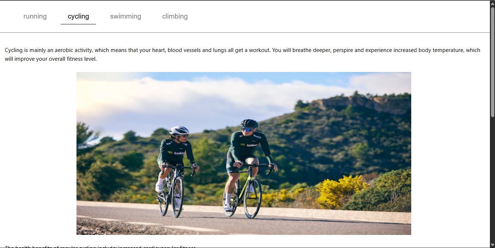

# Tab Component (Vanilla JS)

A simple and responsive **tab switching UI component** built using **HTML, CSS, and JavaScript**.  
This project demonstrates DOM manipulation, state handling, and clean UI design.

---
this project is followed by the roadmap.sh
[Roadmap.sh](https://roadmap.sh/projects/simple-tabs)
---

##  Live Demo
 (https://devkumar3631.github.io/tab-changer/)

---

##  Screenshot

---

##  Tech Stack

- HTML5
- CSS3
- JavaScript (Vanilla JS)